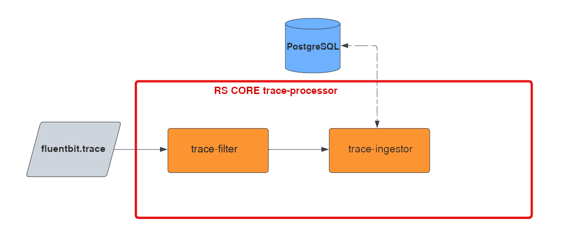

:arrow_heading_up: Go back to the [Reference System Sotfware repository](https://github.com/COPRS/reference-system-software) :arrow_heading_up:

---
# Monitoring

## Overview

This repository contains components to handle traces to be able to monitor the state 
of products produced by the ingestion chain and even all Sentinel processing chain.

### Available components

This repository contains one RS-Core component to process trace by filtering desired one and ingesting them in database.
The [trace-processor](rs-cores/MONITORING) component as the following workflow:


The repository also contains two FINOPS component:
- [object-storage-exporter](finops/object-storage-exporter/helm)
- [resources-exporter](finops/resources-exporter/helm)

## Installation

Each component will provide its own specific installation instructions, which may be found in their respective directory (see [above](#available-components)).

`Next section describe process to install only trace-processor RS-Core component.`

### Prerequisites

- Infrastructure : all the required tools (such as Kafka and PostgreSQL) are included in the RS infrastructure installation.  
  See  [Reference System Software Infrastructure](https://github.com/COPRS/infrastructure) for details.
- PostgreSQL database name **monitoring** is created 

### Build

In order to build the project from source, first clone the GitHub repository :

```shellsession
git clone https://github.com/COPRS/monitoring.git
```

Then build the docker images:

```shellsession
mvn clean deploy -Djib.dest-registry=local/rs-docker/monitoring -Djib.goal=dockerBuild
```

And finally build the zip files:

```shellsession
./rs-cores/build_cores.sh
```

The zip files will be found in the rs-core folder.

### Using Ansible

Run the `deploy-rs-addon.yaml` playbook with the following variables:

- **stream_name**: name given to the stream in *Spring Cloud Dataflow*
- **rs_addon_location**: direct download url of the zip file or zip location on the bastion

### Manual Install

Download and extract the zip file for the RS-Core to install.  
If necessary, edit the parameters as required (See the specific core release note for parameters description).

- Create all objects defined by files in _Executables/additional_resources_
- Using the SCDF GUI:
  - Register the applications using the content of the _stream-application-list.properties_ file
  - Create the streams using the content fo the _stream-definition.properties_ file
  - Deploy the stream using the properties defined in the _stream-parameters.properties_ file (removing comments)

### Uninstall

Using the SCDF GUI, undeploy then destroy the stream relative to the RS-Core.

## Repository Content

The artifactory repository should contain:

- Docker images for the custom components of the core in:  
  https://artifactory.coprs.esa-copernicus.eu/ui/repos/tree/General/rs-docker-private/monitoring
- A zip file (its name includes the version number) for the core in:  
  https://artifactory.coprs.esa-copernicus.eu/ui/repos/tree/General/rs-zip-private
- A tar gz file containing helm content for FINOPS component in:
  https://artifactory.coprs.esa-copernicus.eu/ui/repos/tree/General/rs-helm-private/monitoring

---
## FINOPS
[](https://github.com/COPRS/monitoring/actions/workflows/helm-finops.yml)
[](https://github.com/COPRS/monitoring/actions/workflows/docker-ci-finops.yml)

## Trace processor
[](https://github.com/COPRS/monitoring/actions/workflows/docker-ci-traceprocessor.yml)

# Copyright and license

Copyright (C) 2021-2022, European Space Agency (ESA) https://www.esa.int/

The Reference System Software as a whole is distributed under the Apache License, version 2.0. A copy of this license is available in the [LICENSE](LICENSE) file. Reference System Software depends on third-party components and code snippets released under their own license (obviously, all compatible with the one of the Reference System Software). These dependencies are listed in the [NOTICE](NOTICE.md) file.
